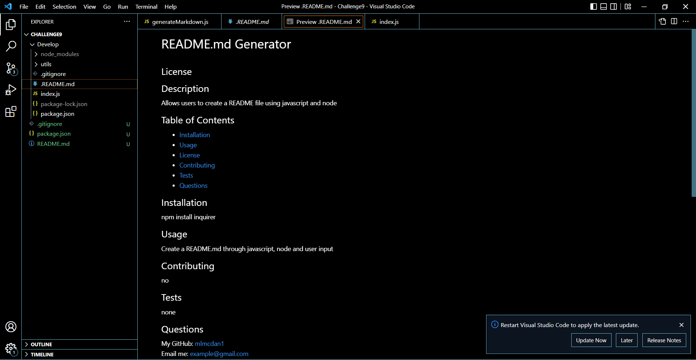

# Professional README Generator Starter Code

In this challenge I was able to practice using node.js and npm. In this assignment I've used lines of codes in the terminal with node to generate 
a README.md file based off users input. 

[README.md Generator Video](https://watch.screencastify.com/v/ix1rWxxpNOVi7cH2XZwQ)
